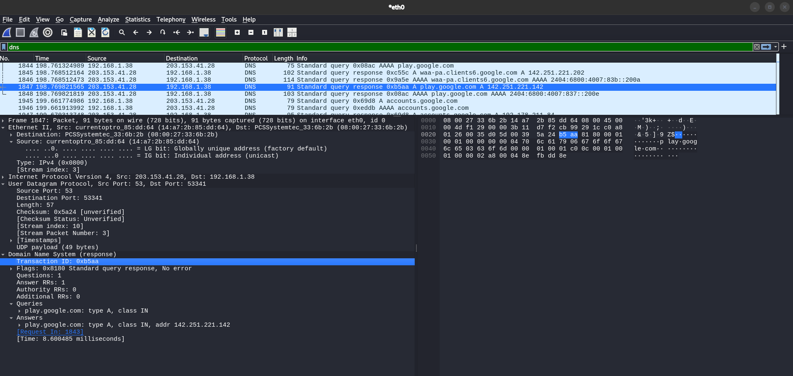
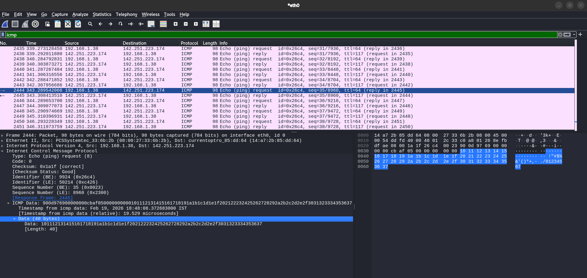
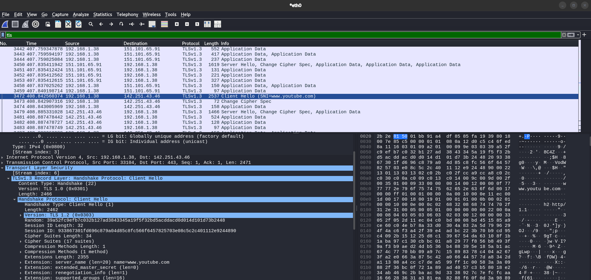

# Task 5 – Capture and Analyze Network Traffic Using Wireshark

## 👨‍💻 Environment
- Operating System: Kali Linux
- Tool Used: Wireshark
- Network Interface: eth0

---

## 🎯 Objective
To capture live network packets and analyze different network protocols such as DNS, TCP, TLS, ICMP, and QUIC using Wireshark.

---

# 📸 Packet Analysis & Evidence

---

## 1️⃣ DNS Packet Analysis

### Observation:
- Protocol: DNS
- Query: play.google.com
- Query Type: A (IPv4)
- Response IP: 142.251.221.142
- Transport Layer: UDP (Port 53)

### Explanation:
DNS (Domain Name System) resolves domain names into IP addresses.  
The system sent a query for `play.google.com` and received the corresponding IPv4 address in the response packet.

---

## 2️⃣ ICMP Packet Analysis (Ping Traffic)

### Observation:
- Protocol: ICMP
- Type: 8 (Echo Request)
- Code: 0
- Destination IP: 142.251.223.174

### Explanation:
ICMP Echo Request packets are generated using the `ping` command.  
This confirms connectivity between the local system and the remote server.

---

## 3️⃣ TLS Handshake Analysis (HTTPS Traffic)

### Observation:
- Protocol: TLSv1.3
- Handshake Type: Client Hello
- Destination Port: 443
- Server Name Indication (SNI): www.youtube.com

### Explanation:
TLS (Transport Layer Security) encrypts HTTPS traffic.  
The Client Hello message initiates a secure encrypted session between the client and server.

---

## 4️⃣ TCP Three-Way Handshake Analysis

### Observation:
- Protocol: TCP
- Flags Observed: SYN, ACK
- Source Port: 443
- Destination Port: 37324

### Explanation:
This packet is part of the TCP three-way handshake:

1. SYN – Client initiates connection  
2. SYN-ACK – Server acknowledges  
3. ACK – Client confirms  

This ensures reliable and ordered data transmission.

---

## 5️⃣ Protocol Hierarchy Statistics

### Observation:

From the Protocol Hierarchy analysis:

- Ethernet: 100%
- IPv4: ~98%
- TCP: ~46%
- TLS: ~17%
- UDP: ~38%
- DNS: ~4%
- ICMP: ~9%
- QUIC (HTTP/3): Present
- HTTP & OCSP traffic observed

### Explanation:

The protocol hierarchy confirms the presence of multiple protocols during capture:

- TCP for reliable communication
- TLS for encrypted HTTPS sessions
- UDP for DNS and QUIC traffic
- DNS for domain resolution
- ICMP for network diagnostics
- QUIC for modern HTTP/3 encrypted transport

This demonstrates diversified network activity during the capture session.

---

# 📁 Capture File

The packet capture file included in this repository:

`task5_capture.pcapng`

---

# 📊 Protocols Identified

During analysis, the following protocols were successfully identified:

- Ethernet
- IPv4
- TCP
- TLS (HTTPS)
- UDP
- DNS
- ICMP
- QUIC (HTTP/3)
- HTTP
- OCSP

---

# 🧠 Key Learnings

- DNS resolves domain names to IP addresses using UDP.
- TCP establishes reliable communication using a three-way handshake.
- TLS encrypts communication for secure web browsing.
- ICMP verifies host reachability.
- QUIC operates over UDP to enable faster HTTP/3 communication.
- Wireshark provides deep protocol inspection and statistical breakdown of traffic.

---

# ✅ Conclusion

Successfully captured and analyzed live network traffic using Wireshark on Kali Linux.

Multiple protocols were identified, filtered, and examined in detail, demonstrating practical knowledge of:

- Packet structure
- Protocol filtering
- TCP handshake analysis
- TLS encryption process
- Network troubleshooting techniques

This task strengthened hands-on skills in network packet analysis and protocol awareness.
